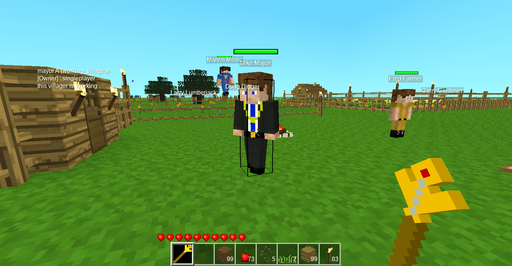
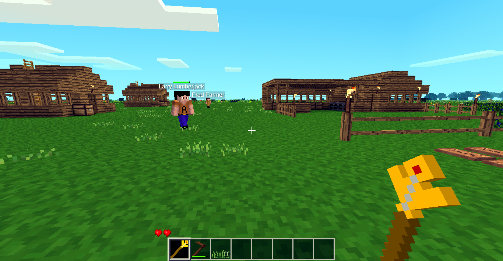
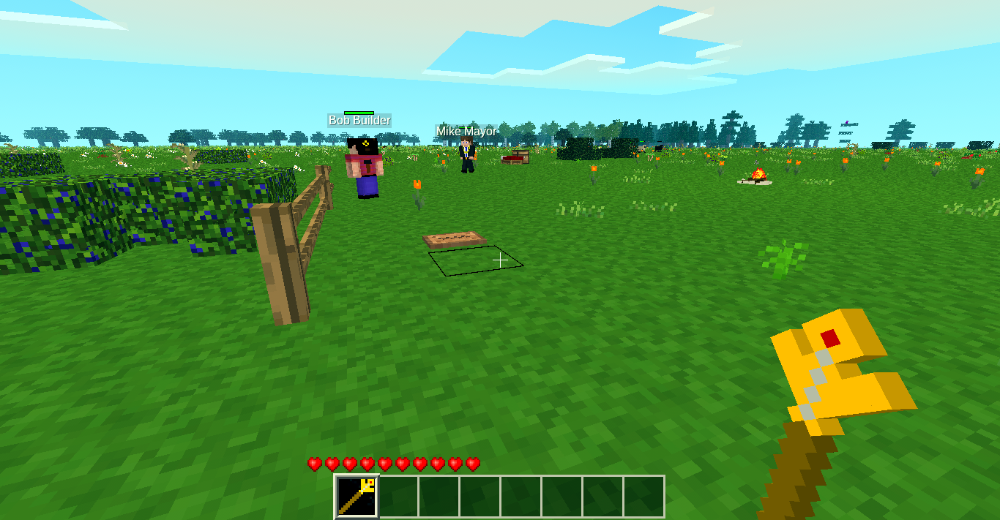
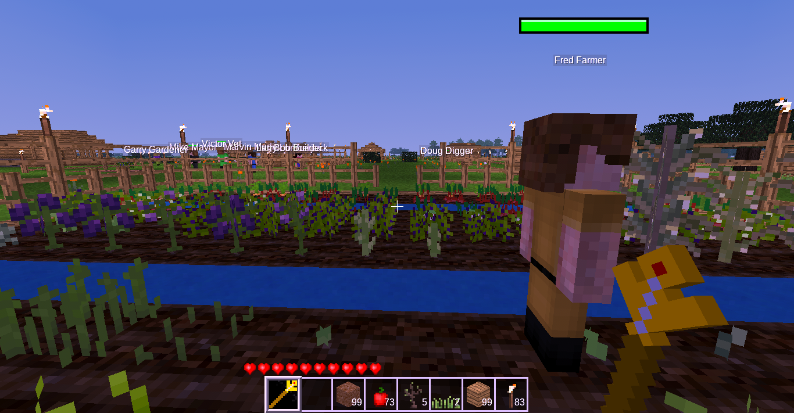

# simple_working_villages mod by RayFT,
  An updated version of the working_villages MOD by theFox6.

## Description:
The main purpose of this mod is to add a Mayor NPC Character to the Minetest Game. 

This being for two reasons:

1) Having an active lived in feel to a world area.

2) To help younger players automate the building and collection process.

Once deployed the Mayor will automatically start to build a small town, and Hire and Manage other Villagers to help.
These other Villagers will fulfill planned jobs in the town to aid in its development.

Your Role is to help manage the Villagers to complete their tasks.

NOTE: until the AI for the Workshop NPC is ready, the player must fulfill this role in the custom built workshop.

## screenshots

## Personal Objectives with this project:
    Having a little look into LUA programming.
    Having a little look into the workings of Minetest.
    Having a little play with 3d pathing.
    Having a little play in Simple Tasked based AI.  

# Code Status
My Code in this mod is "Get it Working" and is as dirty as ya mom.
Current build is experimental and concerned with information gathering.
Be Warned ::: I have not used LUA before taking on this project, its all a learning curve.

**MOSTLY WORKING, WORK IN PROGRESS..**

Not really wanting fixes or updates, as this build is currently experimental only.
Comments and suggestions are most welcome, and may even be implemented.

Complete Refactoring is Planned.

# MINETEST VERSION TESTED WITH THIS MOD.

**Version used for development = 5.12.0**

Planned min testing version = 5.6.1

# MINETEST MODULES TESTED WITH THIS MOD.

These are the minetest mods used with development:

**Basic Materials and items** 
    mt-mods 
**FakeLib** 
    OgelGames 
**Farming Redo** 
    TenPlus1 
**Mobs Redo** 
    TenPlus1 
**Mobs Animal** 
    TenPlus1 
**Mobs Monster** 
    TenPlus1 
**mod utilities** 
    theFox 
**Unified Inventory Plus** 
    mt-mods 
**Unified Dyes** 
    mt-mods 
**Visual Harm 1Ndicators** 
    Mantar 
**WorldEdit** 
    sfan5 
**Xcompat** 
    mt-mods 
**Charater Animations (planned implementation)** 
    LMD 
**HomeDecor** 
    mt-mods 

## MINETEST ENGINE LIMITATIONS: 

Once you are a set distance from the NPC they are saved and unloaded from the world

As a workaround I use the following settings added to the minetest.conf file:

    active_block_range = 8
    active_object_send_range_blocks = 8
    max_block_send_distance = 12
    block_send_optimize_distance = 8

TBH I have not really looked into these settings in any depth.
But it seems that the NPC's will stay in the world upto just over 100 Units away with them implemented.

If the NPC does unload, not all required data is saved or loaded, small bugs like forgetting what they are doing may happen.
(Waiting for the Refactor to fix)

## SKINS:
All skins used in this mod excluding the originals from working_villages are created by myself.

#CURRENT NPC STATUS

## Builder
**Working**
Builds buildings for the town under instructions from the Town Mayor

## Empty
Does nothing.

## Farmer
**Working**
Farms and Replants crops - Thought the player has to plant the first crops to show the farmer what do grow.

## Fireman
Working Prototype
Buggy AI movement, needs updating to current AI
Looks for wild fires, if founds attempts to extinguish them

## Follow_player
**Working**

## Gardener
**Working**
Clears plots ready for Builder (currently under development)
Clears weeds and cuts grass on a plot

## Lumberjack
**Working**
Chops down trees under orders from the Mayor
Manages an Orchard for a wood supply

## Mayor
**Working**
Manages the Town development and NPC's

## Medic
Working Prototype
Buggy AI movement, needs updating to current AI
Searches for wounded friendly NPC's and heals them

## Miner
**Working**
Complexity of the Mining will be updated in the future, this will enable "scanning" for wanted items.
Currently digs a big hole and collects whats dug.

## Plant_collector
Working Prototype
Buggy AI movement, needs updating to current AI
Searches and collects wild farmable crops

## Snowclearer
Working Prototype
Buggy AI movement, needs updating to current AI
Looks for and removes snow

## Torcher
Untested

## Vet
Working Prototype
Buggy AI movement, needs updating to current AI
Same as medic but for friendly animals

## FUTURE ROLE CONSIDERATIONS

**Rubbish Collector**
goes around looking for rubbish to collect

**Sheep Shearer**
Handles the shearing of sheep and collection of Wool

**Cow Milker**
Handles the  milking of Cows and collection of Milk

**Roaming Hunter**
Goes out and Hunts known enemys

**Body guard**
Follows a player and attacks known enemys within a distance

**Policeman**
Goes around the town looking for enemys

**Security guard**
Stands guard on a entrance to a building or Town

**Roadlayer**
Like the builder but only Builds roads and paths

**egg collector**
Collects Eggs from a chicken pen

**Shepard**
Looks after Sheep or Cows

**Waterboy**
Collects water for use by others

**Foundry Worker**
Handles all cooking of recipes 

**Engineer**
Handles Crafting of non-wood based items

**Carpenter**
Handles the crafting of Wood based items

**Baker**
Converts farmed goods into food

**Butcher**
Not sure if applicable ??

**School teacher**
stays with the children in a school enviroment for most of the day

**Child NPC's**
Water boy
rabbit feeder
chicken feeder
ect

## CURRENT / FIXES / KNOWN BUGS

There is a few.. but hopefully less each day.

One to be looked into shortly is the placement of Hires seems to be incorrect, not where I expect some of them to be created..  minor but annoying.
Medic Fixs people well, but his AI cannot handle fences for love nor money. Fix is in the works.

A Dirt with Grass node seems to have slipped in the field schematic..  will be removed at some point.. minor, and I would test with creative at this point of development.
 
A few of the latest bugs "fixed":
    Lumberjack not trying to collect supplies from his chest.
    Miner not trying to collect supplies from his chest.
    Medic not healing the actual Object health, just the entitys health ?
    Farmer not moving into his house correctly
    Plot marker left in Town plan has now been replaced with a test building upgrade

## CURRENT TOWN TODOS

**Problem:** If a NPC dies its currently a pain to get them back.
**Solution:** A rewrite of the Town structural plan to include Hiring and Moving In Jobs as placed markers.
If you then lose a NPC, find the town marker for Hiring him and remove it. On the next Pass the Mayor will ReHire the NPC.
To Movein the New NPC, find his house marker and remove it. The Builder will check the Building and then the Mayor will move in the NPC.

**Problem:** Only one Town-plan is currently available
**Solution:** Have the Town-Planning-Data Selectable and Loadable from a file. Either Different Mayors for Different Towns, or a selection menu for the Town-Plan.

## Animation Updates
Want to add Fly, Swim, Crouch and Climb animations from the "Charater Animations" MOD to the NPC's.

## Animation Updates
It is planned to look into the Wielded item display functions, which currently does not seem to work.

Mayor AI Tasks. 

## LASTLY

    One of the ideas for this mod is to start it in a non-creative mode, like a survival mode.
    Though I have not found the answer to the following question:
    Can a mod add a item to the single player inventory on game start (eg the Mayor NPC) ? 

## CREDITS

Thank you to theFox6 for the work invested in starting this mod.

More information on this MOD can be found on the creators page that this is Forked from..
[working_villages](https://github.com/theFox6/working_villages)

